import WriteupAuthors from '@/components/WriteupAuthors.astro'

We played L3akctf (a no-ai ctf) and got 15th!

## forensics/Relizane Is Down!

<WriteupAuthors
  ids={['lolmeow']}
  author="Houssem0x1"
  solves={2}
  points={478}
  files="https://github.com/L3AK-TEAM/L3akCTF2026-public/tree/main/forensics/Relizane%20is%20Down!"
/>

Over the weekend, I played L3akCTF with Cosmic Bit Flip! Although I didn’t have much time, after solving one challenge, I focused on this low-solve challenge.

A lot of people struggled to get past question 1, so I decided to make a writeup targeting this question.

The challenge provides you with a flattened filesystem in the form of a zip file. Extracting the ZIP file provides you with this tree:

```powershell
PS C:\WINDOWS\system32> tree C:\Users\Cypat\Pictures\L3akCTF_RID_triage_handout\final_triage
Folder PATH listing for volume Windows
Volume serial number is 2029-DD5C
C:\USERS\CYPAT\PICTURES\L3AKCTF_RID_TRIAGE_HANDOUT\FINAL_TRIAGE
├───C
│   ├───$Extend
│   ├───ProgramData
│   │   └───Microsoft
│   │       ├───search
│   │       │   └───data
│   │       │       └───applications
│   │       │           └───windows
│   │       │               └───GatherLogs
│   │       │                   └───SystemIndex
│   │       ├───Windows
│   │       │   └───Start Menu
│   │       │       └───Programs
│   │       └───Windows Defender
│   │           ├───Scans
│   │           │   └───History
│   │           │       └───Service
│   │           │           └───DetectionHistory
│   │           │               ├───02
│   │           │               ├───13
│   │           │               ├───18
│   │           │               └───19
│   │           └───Support
│   ├───Users
│   │   ├───bello
│   │   │   ├───AppData
```

*A Windows filesystem!*

The challenge also provides us with an ncat instance to answer questions about the filesystem:

`ncat --ssl relizane-is-down.instances.ctf.l3ak.team 1337`

Upon connecting, we are asked the first question, which this post will guide you through solving:

```text
┌──(shell㉿adam)-[~]
└─$ sudo ncat --ssl relizane-is-down.instances.ctf.l3ak.team 1337

We trust you have received the usual lecture from the local System
Administrator. It usually boils down to these three things:

    #1) Respect the privacy of others.
    #2) Think before you type.
    #3) With great power comes great responsibility.

For security reasons, the password you type will not be visible.

[sudo] password for shell:

-------------------------------------------------- Relizane is Down! --------------------------------------------------

-------------------------------------------------- Author: Houssem0x1 --------------------------------------------------

*** NOTE 1: All timestamps must be in UTC and should be in the following format: YYYY-MM-DD HH:MM:SS

*** NOTE 2: You have to answer all the questions with the required format to get the flag at the end.


--- Question 1/20 ---
What was the last text copied by the user?
format: ex: life is good!
>>
```

Any text copied by a user in the Windows operating system can be saved to the clipboard if clipboard history has been turned on by the user in Settings:

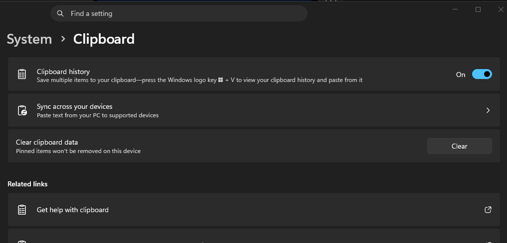

*Example of this setting in Windows 11*

All clipboard items are saved in RAM, meaning that once you restart or shut down the computer, the contents of the clipboard disappear. There is one exception to this rule: pinned clipboard items.

Pinned clipboard items work exactly as the name suggests: any copied text remains toward the top of the clipboard and persists across reboots. Because we are given a fileless system, we can reasonably assume that the user has a pinned clipboard item because it would not be possible to see any non-pinned items.

After doing some [research](https://superuser.com/questions/1778831/where-is-the-file-that-contains-pinned-items-in-windows-10-clipboard), we know that pinned clipboard items are saved under `C:\Users\[user]\AppData\Local\Microsoft\Windows\Clipboard\Pinned`

In this folder, we see one pinned clipboard item:

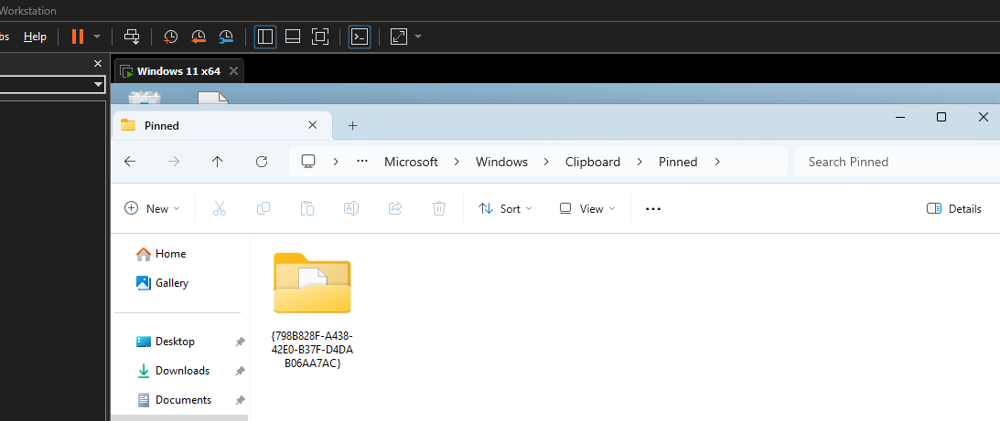

### Experimenting with a Solution

Opening the folder reveals several files that are not readable:

```powershell
PS C:\WINDOWS\system32> cd "C:\Users\Cypat\Pictures\L3akCTF_RID_triage_handout\final_triage\C\Users\bello\AppData\Local\Microsoft\Windows\Clipboard\Pinned\{798B828F-A438-42E0-B37F-D4DAB06AA7AC}\{D4315CDF-3E40-4E08-B8BA-220AF192A67F}"
PS C:\Users\Cypat\Pictures\L3akCTF_RID_triage_handout\final_triage\C\Users\bello\AppData\Local\Microsoft\Windows\Clipboard\Pinned\{798B828F-A438-42E0-B37F-D4DAB06AA7AC}\{D4315CDF-3E40-4E08-B8BA-220AF192A67F}> cat .\TG9jYWxl
0‚Á     *†H†÷
 ‚²0‚®1‚z¢‚v0‚8‚ÐŒßÑŒzÀO—ëK6   Ó;ÉøH©)Vcidf ¼ðÚá½=Të tó##c|ÏhMt]r6çÜsc?€ L‘Ú¶Ð
%‰»+¾Z?‹Àì¿öEö¶.Û£#Ø0æa‡Ìv¬a¨Yyty€°=‘þµáÑD¾+‘å8qÞ•vdoòð˜èÛ@c*ÄIËŸÂü¸—÷óÕUŸ+Ãö‡À
ô‰wì”@•Œ•7Ì
·ÿ2s»U{(d&F{ŠE`¥Eý½( Úx<3W0,    +‚7J0
+‚7000

LOCAL
user0
        `†He-(¾’JÀÆÈ‚>"K~Üêµg’h~¬¶;¬ÓCHÄ9|9 ã™÷¤·0+     *†H†÷
0       `†He.0
¤Ñí5‡INéq½+3
¸*|AÜV»œ]œ€|5#Ì
PS C:\Users\Cypat\Pictures\L3akCTF_RID_triage_handout\final_triage\C\Users\bello\AppData\Local\Microsoft\Windows\Clipboard\Pinned\{798B828F-A438-42E0-B37F-D4DAB06AA7AC}\{D4315CDF-3E40-4E08-B8BA-220AF192A67F}> cat .\VGV4dA==
0‚Á     *†H†÷
 ‚²0‚®1‚z¢‚v0‚8‚ÐŒßÑŒzÀO—ëK6   Ó;ÉøH©)Vcidf ¦shõ
*6í_bðÄ %7ÉâÜ"kËÇ#`ŒÎwþš€
¹%¯øüS¥Ç‰³¢o␦B$¶«‘¨“À  ë0ßåõ0)ÈÍi␦®3¨Ëã °ç8-íz³(›äìæíG*b.¿¥¨ \—š‹ë¯i(÷‘î@“Õ¨7\Sª¾ˆ¹Ò°½gœ¸×ê„»êÅKÓUKSÙÎáÅK‰Oú
3_ÿŽ ®RV­æò™0,  +‚7J0
+‚7000

LOCAL
user0
        `†He-(  jt$KÂ#H^10²°¾:áÝ03‚a·,†dµºÉµ5œ³õ¸•0+    *†H†÷
0       `†He.0
Ù?ŠS|qZ]HOÛaE­™÷ûz¿ª¬îT7èÙ³G¢Ä‹Ýý&òÁÿ…
PS C:\Users\Cypat\Pictures\L3akCTF_RID_triage_handout\final_triage\C\Users\bello\AppData\Local\Microsoft\Windows\Clipboard\Pinned\{798B828F-A438-42E0-B37F-D4DAB06AA7AC}\{D4315CDF-3E40-4E08-B8BA-220AF192A67F}>
```

*Yikes!*

Knowing this, I tried to look for a tool that could put this into a readable format.

Digging around the internet, I stumbled across this [article](https://www.passcape.com/index.php?page=1393).

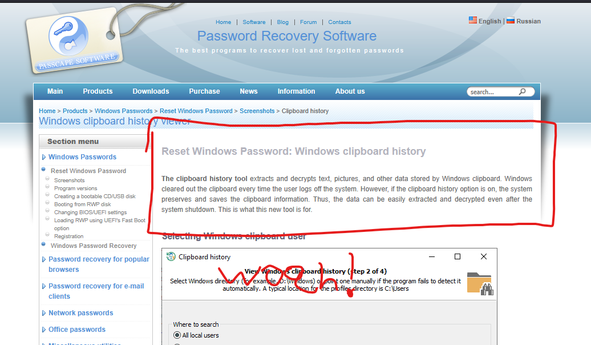

*Exactly what I need, right?*

This tool required booting into a live recovery media disk, so that is exactly what I did. On my virtual machine, I booted into the live disk provided by Passcape and clicked the “Clipboard History” option under the forensic tools section.

Sure enough, this wasn’t as easy as I thought it would be:

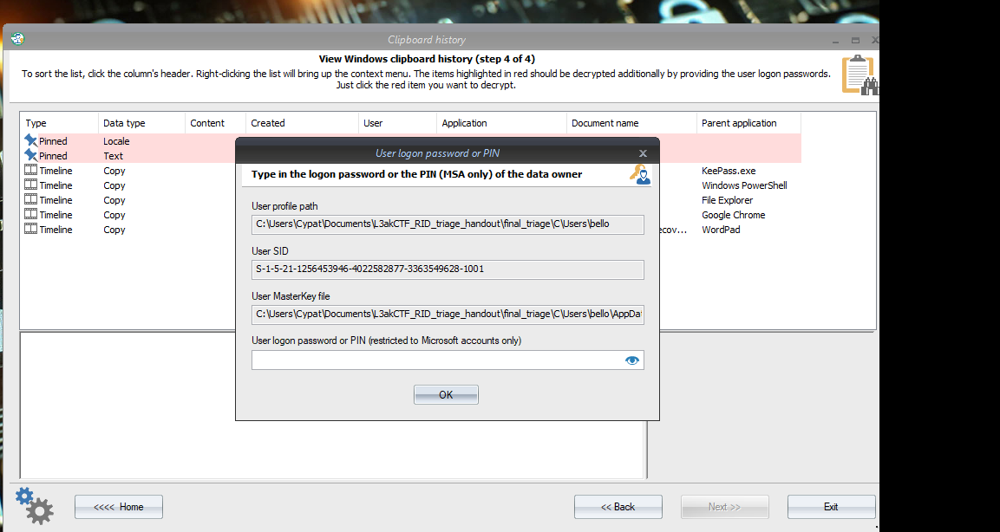

Knowing this, I pivoted to finding the password for the user account bello.

I tried grabbing the hash and cracking it; obviously, this did not work. I then searched the disk further and stumbled upon a zip file:

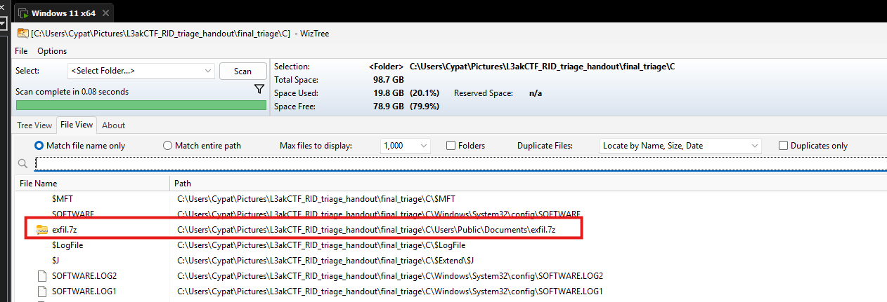

Opening the ZIP archive revealed several files:

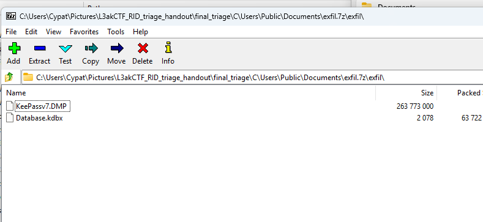

We are given a dump file for KeePass and a vault. Being provided with a dump file was unusual, so I did some digging on why.

I stumbled upon this search [result](https://www.sysdig.com/blog/keepass-cve-2023-32784-detection):

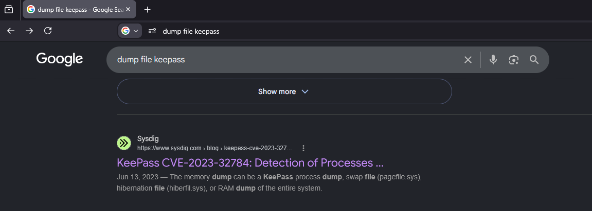

Below that result was a GitHub [repo](https://github.com/vdohney/keepass-password-dumper) containing a PoC.

### CVE-2023-32784

TL;DR: An attacker can recover credentials from a KeePass vault using a live memory dump, except for the first character.

[SentinelOne](https://www.sentinelone.com/vulnerability-database/cve-2023-32784/) describes how this vulnerability occurs:

> “The root cause stems from KeePass’s custom-developed text box control used for password entry. This control processes each keystroke in a manner that leaves recoverable string remnants in memory. When a user types their master password character by character, each input operation creates memory artifacts that can be correlated to reconstruct the entered password.”

### Using the CVE

After building the project from the PoC using dotnet, we get the following result when it is run:

```text
Found: ●a Found: ●a Found: ●a Found: ●a Found: ●a Found: ●a Found: ●a Found: ●a Found: ●a Found: ●a Found: ●●l Found: ●●l Found: ●●l Found: ●●l Found: ●●l Found: ●●l Found: ●●l Found: ●●l Found: ●●l Found: ●●l Found: ●●●g Found: ●●●g Found: ●●●g Found: ●●●g Found: ●●●g Found: ●●●g Found: ●●●g Found: ●●●g Found: ●●●g Found: ●●●g Found: ●●●●e Found: ●●●●e Found: ●●●●e Found: ●●●●e Found: ●●●●e Found: ●●●●e Found: ●●●●e Found: ●●●●e Found: ●●●●e Found: ●●●●e Found: ●●●●●r Found: ●●●●●r Found: ●●●●●r Found: ●●●●●r Found: ●●●●●r Found: ●●●●●r Found: ●●●●●r Found: ●●●●●r Found: ●●●●●r Found: ●●●●●r Found: ●●●●●●i Found: ●●●●●●i Found: ●●●●●●i Found: ●●●●●●i Found: ●●●●●●i Found: ●●●●●●i Found: ●●●●●●i Found: ●●●●●●i Found: ●●●●●●i Found: ●●●●●●i Found: ●●●●●●●a Found: ●●●●●●●a Found: ●●●●●●●a Found: ●●●●●●●a Found: ●●●●●●●a Found: ●●●●●●●a Found: ●●●●●●●a Found: ●●●●●●●a Found: ●●●●●●●a Found: ●●●●●●●a Found: ●●●●●●●●4 Found: ●●●●●●●●4 Found: ●●●●●●●●4 Found: ●●●●●●●●4 Found: ●●●●●●●●4 Found: ●●●●●●●●4 Found: ●●●●●●●●4 Found: ●●●●●●●●4 Found: ●●●●●●●●4 Found: ●●●●●●●●4 Found: ●●●●●●●●●e Found: ●●●●●●●●●e Found: ●●●●●●●●●e Found: ●●●●●●●●●e Found: ●●●●●●●●●e Found: ●●●●●●●●●e Found: ●●●●●●●●●e Found: ●●●●●●●●●e Found: ●●●●●●●●●e Found: ●●●●●●●●●e Found: ●●●●●●●●●●v Found: ●●●●●●●●●●v Found: ●●●●●●●●●●v Found: ●●●●●●●●●●v Found: ●●●●●●●●●●v Found: ●●●●●●●●●●v Found: ●●●●●●●●●●v Found: ●●●●●●●●●●v Found: ●●●●●●●●●●v Found: ●●●●●●●●●●v Found: ●●●●●●●●●●●e Found: ●●●●●●●●●●●e Found: ●●●●●●●●●●●e Found: ●●●●●●●●●●●e Found: ●●●●●●●●●●●e Found: ●●●●●●●●●●●e Found: ●●●●●●●●●●●e Found: ●●●●●●●●●●●e Found: ●●●●●●●●●●●e Found: ●●●●●●●●●●●e Found: ●●●●●●●●●●●●r Found: ●●●●●●●●●●●●r Found: ●●●●●●●●●●●●r Found: ●●●●●●●●●●●●r Found: ●●●●●●●●●●●●r Found: ●●●●●●●●●●●●r Found: ●●●●●●●●●●●●r Found: ●●●●●●●●●●●●r Found: ●●●●●●●●●●●●r Found: ●●●●●●●●●●●●r Found: ●●●●●●●●●●●●●2 Found: ●●●●●●●●●●●●●2 Found: ●●●●●●●●●●●●●2 Found: ●●●●●●●●●●●●●2 Found: ●●●●●●●●●●●●●2 Found: ●●●●●●●●●●●●●2 Found: ●●●●●●●●●●●●●2 Found: ●●●●●●●●●●●●●2 Found: ●●●●●●●●●●●●●2 Found: ●●●●●●●●●●●●●2 Found: ●●●●●●●●●●●●●●1 Found: ●●●●●●●●●●●●●●1 Found: ●●●●●●●●●●●●●●1 Found: ●●●●●●●●●●●●●●1 Found: ●●●●●●●●●●●●●●1 Found: ●●●●●●●●●●●●●●1 Found: ●●●●●●●●●●●●●●1 Found: ●●●●●●●●●●●●●●1 Found: ●●●●●●●●●●●●●●1 Found: ●●●●●●●●●●●●●●1 Found: ●●●●●●●●●●●●●●●3 Found: ●●●●●●●●●●●●●●●3 Found: ●●●●●●●●●●●●●●●3 Found: ●●●●●●●●●●●●●●●3 Found: ●●●●●●●●●●●●●●●3 Found: ●●●●●●●●●●●●●●●3 Found: ●●●●●●●●●●●●●●●3 Found: ●●●●●●●●●●●●●●●3 Found: ●●●●●●●●●●●●●●●3 Found: ●●●●●●●●●●●●●●●3 Found: ●●●●●●●●●●●●●●●●! Found: ●●●●●●●●●●●●●●●●! Found: ●●●●●●●●●●●●●●●●! Found: ●●●●●●●●●●●●●●●●! Found: ●●●●●●●●●●●●●●●●! Found: ●●●●●●●●●●●●●●●●! Found: ●●●●●●●●●●●●●●●●! Found: ●●●●●●●●●●●●●●●●! Found: ●●●●●●●●●●●●●●●●! Found: ●●●●●●●●●●●●●●●●! Found: ●Ï Found: ●§ Found: ●e Found: ●* Found: ●\ Found: ●e Found: ●{ Found: ●W Found: ●W Password candidates (character positions): Unknown characters are displayed as "●" 1.: ● 2.: a, Ï, §, e, *, \, {, W, 3.: l, 4.: g, 5.: e, 6.: r, 7.: i, 8.: a, 9.: 4, 10.: e, 11.: v, 12.: e, 13.: r, 14.: 2, 15.: 1, 16.: 3, 17.: !, Combined: ●{a, Ï, §, e, *, \, {, W}lgeria4ever213!
```

Obviously, the correct candidate is `a` for Algeria; however, we are missing a letter.

Using the KeePass CLI and brute-forcing the first character, we get `#`. The KeePass vault password is: `#algeria4ever213!`

Unlocking the vault, we find the Windows logon password for bello, which is `@algeria@relizane48!`

### DPAPI-NG

I went back to my original tool and tried to enter the password I recovered; however, the program kept saying that it was wrong, even though I had triple-checked that the password was right. I kept trying and eventually gave up and decided to decrypt it on my own.

While searching, I stumbled upon this [article](https://thinkdfir.com/2018/10/14/clippy-history/) which says:

> “Vico Marizale has done some additional research on this topic! At the time I didn’t look into the syncing feature, but because of this I took a very quick look at the pinned items again. I opened up a pinned item in Nirsoft’s DataProtectionDecryptor and it seems to have “decrypted” the data, but saving it out and removing the DAPI header didn’t seem to result in a bitmap. But apparently the data is encrypted with the newer version of DPAPI; DPAPI-NG. So now to find a tool to decrypt that!”

What is DPAPI-NG exactly? Well, it is another one of Microslop’s security features for encrypting data. It is used for passwords, network keys, credential files, and, of course, the pinned clipboard.

### DPAPI-NG Structure

Let’s convert one of the files found in the clipboard path to hex and analyze it. We will convert the file named `VGV4dA==` because it decodes to `Text`, which is what we need:

```text
30 82 01 c1 06 09 2a 86 48 86 f7 0d 01 07 03 a0 82 01 b2 30 82 01 ae 02 01 02 31 82 01 7a a2 82 01 76 02 01 04 30 82 01 38 04 82 01 06 01 00 00 00 d0 8c 9d df 01 15 d1 11 8c 7a 00 c0 4f c2 97 eb 01 00 00 00 4b 36 09 d3 3b c9 f8 48 a9 06 29 13 56 63 69 64 00 00 00 00 02 00 00 00 00 00 10 66 00 00 00 01 00 00 20 00 00 00 a6 73 68 f5

0c 2a 36 ed 5f 00 16 62 f0 c4 a0 25 37 c9 e2 dc 22 18 6b cb c7 23 60 8c ce 77 fe 9a 00 00 00 00 0e 80 00 00 00 02 00 00 20 00 00 00 0a b9 25 af f8 fc 53 a5 c7 89 16 b3 14 a2 6f 11 90 1a 42 0f 24 b6 13 ab 91 a8 93 c0 13 a0 a0 eb 30 00 00 00 df e5 f5 30 29 c8 cd 69 02 1a ae 33 a8 cb e3 20 b0 e7 38 2d ed 7a b3 28 9b e4 ec e6 ed 47 2a

62 2e bf a5 a8 20 5c 97 9a 8b eb af 69 28 f7 91 ee 40 00 00 00 93 d5 11 a8 81 37 5c 53 aa be 10 88 b9 d2 17 1d b0 bd 67 9c b8 02 d7 ea 84 bb ea c5 4b 62 08 1f d3 12 55 4b 53 d9 ce e1 c5 11 4b 89 4f 14 fa 02 0d 33 5f ff 8e 8f 1b 39 ae 52 56 ad e6 f2 99 16 30 2c 06 09 2b 06 01 04 01 82 37 4a 01 30 1f 06 0a 2b 06 01 04 01 82 37 4a 01

08 30 11 30 0f 30 0d 0c 05 4c 4f 43 41 4c 0c 04 75 73 65 72 30 0b 06 09 60 86 48 01 65 03 04 01 2d 04 28 09 6a 74 24 4b c2 23 48 5e 31 30 b2 b0 14 be 3a e1 dd 30 33 01 82 61 b7 2c 86 64 b5 ba 05 1c c9 b5 35 9c b3 f5 b8 95 04 30 2b 06 09 2a 86 48 86 f7 0d 01 07 01 30 1e 06 09 60 86 48 01 65 03 04 01 2e 30 11 04 0c d9 3f 10 8a 53 7c

01 71 5a 5d 1b 77 02 01 10 48 06 4f db 61 45 0f ad 99 f7 fb 7a bf aa ac ee 54 37 e8 d9 b3 47 a2 81 c4 8b dd fd 16 26 f2 c1 ff 85 14 07
```

This [article](https://learn.microsoft.com/en-us/windows/win32/seccng/protected-data-format) tells us that DPAPI-NG uses ASN.1, so using an ASN.1 decoder, we can figure out what each part of the hex means. A useful site for this is [https://lapo.it/asn1js](https://lapo.it/asn1js).

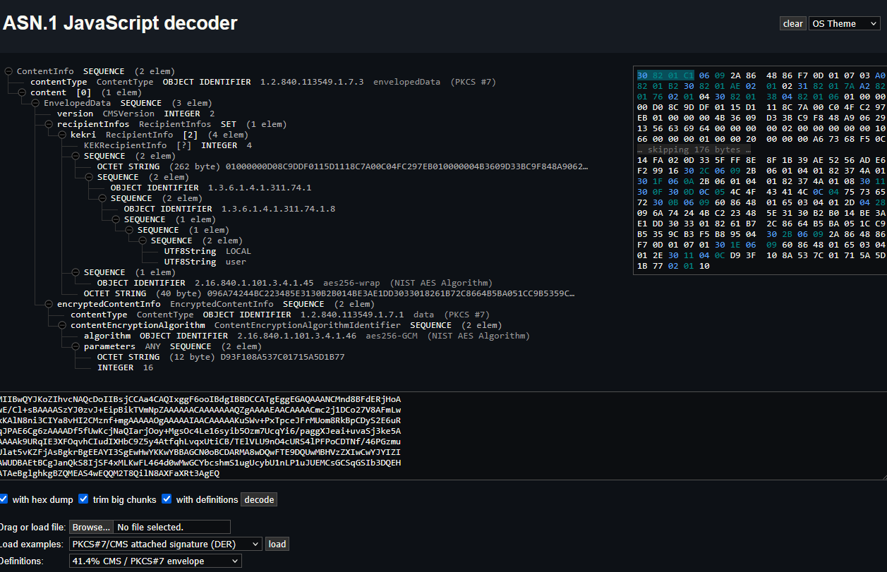

**`30 82 01 C1`** -> Identifies an ASN.1 SEQUENCE. `82` tells us that the next two bytes give the length, and the next two bytes, `01 C1`, tell us that there will be 449 bytes of data.

**`06 09 2a 86 48 86 f7 0d 01 07 03`** -> Identifies the data with an object identifier of 1.2.840.113549.1.7.3. Googling this tells us that the content type is PKCS CMS EnvelopedData.

**`a0 82 01 b2`** -> The content length is 434 bytes.

**`09 6A 74 24 4B C2 23 48 5E 31 30 B2 B0 14 BE 3A E1 DD 30 33 01 82 61 B7 2C 86 64 B5 BA 05 1C C9 B5 35 9C B3 F5 B8 95 04`** -> An AES-256-wrapped key. More on this later, but this indicates that there is a wrapping algorithm. You can learn more about why it is used [here](https://security.stackexchange.com/questions/270194/what-is-the-point-of-the-aes-key-wrap-algorithm)

**`06 09 60 86 48 01 65 03 04 01 2e`** -> Uses AES-256-GCM.

**`d9 3f 10 8a 53 7c 01 71 5a 5d 1b 77`** -> A parameter containing the IV used for AES encryption.

**`02 01 10`** -> Specifies an authentication tag length of 16 bytes.

The last 36 bytes can reasonably be divided into 20 bytes of ciphertext followed by a 16-byte GCM authentication tag. Lowkey, I do not know whether this is consistent across other files, but this [repo](https://github.com/jborean93/dpapi-ng/blob/eac650f928af3eee494f7312131d540a81c5e8af/src/dpapi_ng/_blob.py#L240) has a Python implementation of `dpapi_ng` and it indicates that it stores the encrypted blob after the structure so we ball yolo 67.

**`48 06 4f db 61 45 0f ad 99 f7 fb 7a bf aa ac ee 54 37 e8 d9`** -> Encrypted data.

**`b3 47 a2 81 c4 8b dd fd 16 26 f2 c1 ff 85 14 07`** -> Authentication tag.

What we are missing is the key, and that is where the Windows logon password comes into play.

### DataProtectionDecryptor

The content encryption key is itself protected using Windows DPAPI. To recover it, we must decrypt the relevant DPAPI-protected value using the Windows password recovered above. We can do this using a tool from NirSoft called [DataProtectionDecryptor](https://www.nirsoft.net/utils/dpapi_data_decryptor.html)

We type in the details requested:

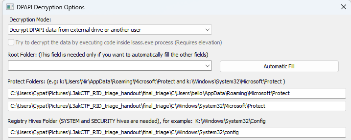

The tool asks us for the logon password. However, the account is a Microsoft account, so we must use a separate tool to extract that password. We do this because Windows creates another secret for that Microsoft account to protect the DPAPI master keys.

To obtain this password, NirSoft redirects us to this [tool](https://www.nirsoft.net/utils/microsoft_account_dpapi_password.html) which will extract it for us.

After entering the requested details, we get the password:

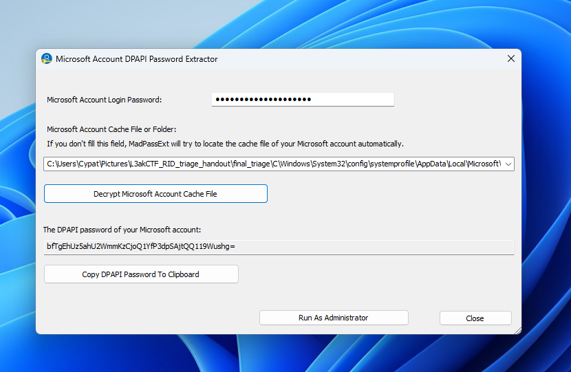

`bfTgEhUz5ahU2WmmKzCjoQ1YfP3dpSAjtQQ119Wushg=`

After entering that password, we specify that we want to decrypt the `VGV4dA==` file.

Our final configuration should look like this:

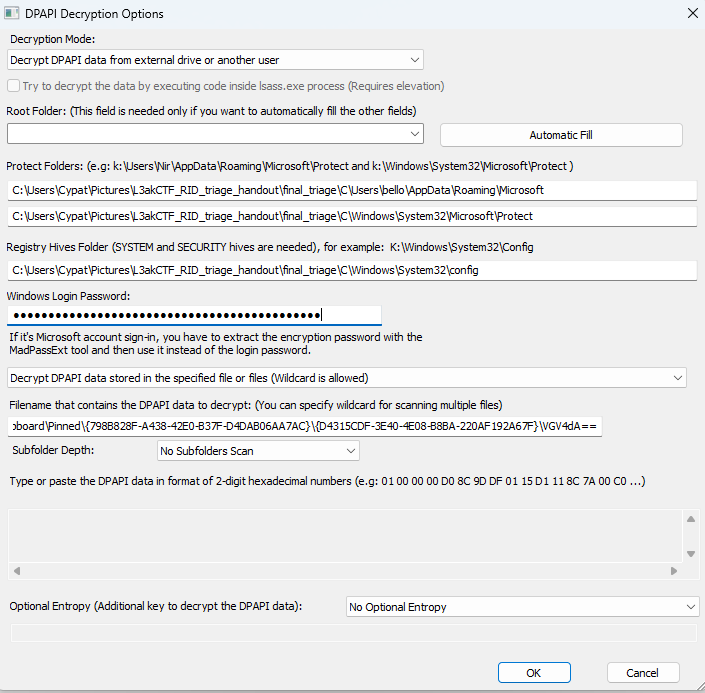

Clicking OK successfully decrypts the file.

```text
0000   61 0E B0 82 DF D7 50 B3 46 32 6C 02 94 9B 3B 0D    a.....P.F2l...;.
0010   E7 F9 0D 96 6E 25 27 A9 7E 40 FE 03 90 97 35 4C    ....n%'.~@....5L
```

However, we aren’t done yet. This is just the content encryption key, also called the KEK. We must unwrap it to get the actual content-encryption key.

I used this CyberChef [recipe](https://gchq.github.io/CyberChef/#recipe=AES_Key_Unwrap(%7B'option':'Hex','string':'61%200E%20B0%2082%20DF%20D7%2050%20B3%2046%2032%206C%2002%2094%209B%203B%200DE7%20F9%200D%2096%206E%2025%2027%20A9%207E%2040%20FE%2003%2090%2097%2035%204C'%7D,%7B'option':'Hex','string':'a6a6a6a6a6a6a6a6'%7D,'Hex','Hex')&input=MDkgNkEgNzQgMjQgNEIgQzIgMjMgNDggNUUgMzEgMzAgQjIgQjAgMTQgQkUgM0EgRTEgREQgMzAgMzMgMDEgODIgNjEgQjcgMkMgODYgNjQgQjUgQkEgMDUgMUMgQzkgQjUgMzUgOUMgQjMgRjUgQjggOTUgMDQ) to unwrap it, which gives us the final key: `4cd8e33837a6e12ce8355f42ac70b6e47375552295b8d47e894856935efa5171`

### AES Decryption

After [entering](https://gchq.github.io/CyberChef/#recipe=AES_Decrypt(%7B'option':'Hex','string':'4cd8e33837a6e12ce8355f42ac70b6e47375552295b8d47e894856935efa5171'%7D,%7B'option':'Hex','string':'d9%203f%2010%208a%2053%207c%2001%2071%205a%205d%201b%2077'%7D,16,'GCM','Hex','Raw',%7B'option':'Hex','string':'b3%2047%20a2%2081%20c4%208b%20dd%20fd%2016%2026%20f2%20c1%20ff%2085%2014%2007'%7D,%7B'option':'Hex','string':''%7D,'Off')&input=NDggMDYgNGYgZGIgNjEgNDUgMGYgYWQgOTkgZjcgZmIgN2EgYmYgYWEgYWMgZWUgNTQgMzcgZTggZDk) all the parameters found above, we finally get the pinned clipboard item!

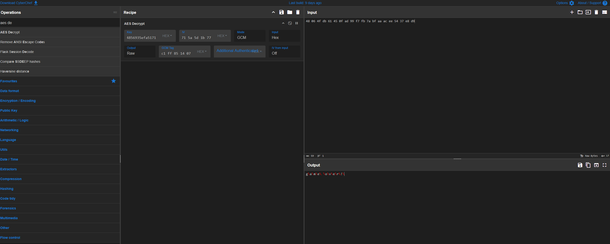

```text
┌──(shell㉿adam)-[~]
└─$ sudo ncat --ssl relizane-is-down.instances.ctf.l3ak.team 1337

We trust you have received the usual lecture from the local System
Administrator. It usually boils down to these three things:

    #1) Respect the privacy of others.
    #2) Think before you type.
    #3) With great power comes great responsibility.

For security reasons, the password you type will not be visible.

[sudo] password for shell:

-------------------------------------------------- Relizane is Down! --------------------------------------------------

-------------------------------------------------- Author: Houssem0x1 --------------------------------------------------

*** NOTE 1: All timestamps must be in UTC and should be in the following format: YYYY-MM-DD HH:MM:SS

*** NOTE 2: You have to answer all the questions with the required format to get the flag at the end.


--- Question 1/20 ---
What was the last text copied by the user?
format: ex: life is good!
>> game over!
✔ Correct! Moving to the next question.
```

It is correct!

## crypto/A Fine Product

<WriteupAuthors
  ids={['wjaaaaaaat']}
  author="kyc"
  solves={5}
  points={405}
  files="https://github.com/L3AK-TEAM/L3akCTF2026-public/tree/main/crypto/a-fine-product"
/>

### challenge script analysis

Each instance of this challenge generates 99 random linear functions mod `N = 9**99` (lines 7-15). These are checked to ensure they are invertible (`if gcd(a, 9) == 1`).
```py
# generate 99 functions of the form f_i(s) = a_i * s + b_i (mod 9^99)
print('Here are my functions:')
functions = []
while len(functions) < 99:
    a = randbelow(N)
    b = randbelow(N)
    if gcd(a, 9) == 1:
        print(f'f_{len(functions)}(s) = {a} * s + {b}')
        functions.append((a, b))
```

One more linear function is stored, initialized as the identity `f(x) = x`, with its coefficients stored in `composed_a` and `composed_b` (line 18). We will refer to it as `composed`.
```py
composed_a, composed_b = 1, 0
```

Next, a menu is presented 999 times with 2 choices.
The first allows us to select any of the 99 functions `f_i` by its index `i` and compose it with `composed`, essentially setting `composed = f_i(composed)` (lines 27-35).
```py
    if choice == 1:
        print('Enter function indices:')
        for _ in range(9999):
            line = input().strip()
            if line == 'done':
                break
            else:
                a, b = functions[int(line)]
                composed_a, composed_b = (composed_a * a) % N, (composed_b * a + b) % N
```

The second generates two primes close in magnitude to `N`, `secret` and `start`. It then sets `end = composed(start)` and checks if `end` is prime. If it is, `secret * start * end` is provided and we must guess `secret` for the flag (lines 37-46).
```py
    elif choice == 2:
        print('Generating factors...')
        secret = getPrime(N.bit_length() - 1)
        start = getPrime(N.bit_length() - 1)
        end = (start * composed_a + composed_b) % N
        print(f'Product: {secret * start * end if isPrime(end) else "REDACTED"}')

        guess = int(input('What was my secret? >'))
        if guess == secret:
            print(open('flag.txt').read())
```

To summarize, we are give 99 random invertible linear functions mod `N = 9**99` and are allowed to compose a sequence of up to around `999 * 9999 ~= 10000000` of them to create another linear function, `composed`. We are then given up to around `999` tries, depending on how many functions were composed, to guess a random prime `secret` given `secret * start * composed(start)`, where `start` is another random prime.

### guessing `secret` given choice of `composed`

It is clear that we must exploit the linear relationship between `start` and `end`. However, there are several conditions on `composed` to mount a successful attack.

First, most linear functions that `composed` could become would not produce that desired relationship because they all reduce the output mod `N`. So, the `composed` we seek must have very small linear coefficient and fairly small constant coefficient.

Next, `end` must be prime to leak the product that is our only source of info on `secret`, meaning that `composed` must have a non-negligible change of producing prime outputs when given prime inputs.

One of the simplest functions that comes to mind is `f(x) = 2*x + 1`, producing `end = 2*start + 1`. Assuming `end` is prime, which indeed happens frequently enough for our purposes, `pow(anything, 2*start*anything2) - 1` is a multiple of `end` by FLT (for arbitrary `anything, anything2`).

Let `n = product` for brevity. Note that `2*n` is a multiple of `2*start`, so taking `pow(2, 2*n) -1` will also yield a multiple of `end`. Finally, use gcd's efficiency to extract `end = gcd(pow(2, 2*n, n) - 1, n)` (taking the power mod `n` so that the computation is actually possible).

Once `end` has been found, `start = end // 2` and `secret = n // (start*end)` are easy to find in turn.

However, this is only half the problem solved. We still need to get `composed` equal to `f(x) = 2*x + 1` in the first place.

### obtaining desired `composed_a`

First, I noticed that invertible linear functions mod `N = 9**99` form a group, although not an abelian one. I implemented a class to simulate elements of this and similar groups in [`affine.py`](https://github.com/wjaaaaaaat/writeups/blob/main/L3ak/crypto_a-fine-product/affine.py).

After some time, I realized that the linear coefficient of a composition within this group depends only on the linear coefficients of the composed functions (in fact, it is the product of them). In other words, if we ignore the constant coefficient, the group structure resembles that of the cyclic group mod `N`.

Importantly, the problem of finding a sequence of functions (from the 99 given) that compose to a function with a certain linear coefficient is reduced to the problem of finding a sequence of linear coefficients (from the 99 given) that multiply to the desired linear coefficient.

This problem can in turn be reduced to an additive version of itself mod totient(`N`) by taking the discrete log of all relevant values mod `N` (which is efficient thanks to `N` being a prime power). We can use `2` as a base because it is a multiplicative generator mod `N`.

Now, it looks very similar to the subset sum problem, evoking thoughts of lattice reduction. In fact, this problem was made to be solved by lattice reduction. In case the last few sentences were too dense, here is the mathematical procedure.

Let the given functions be $f_i(s) = a_i s + b_i$ for $i \in \{0, \dots, 98\}.$ Next, let $A_i$ be the discrete log of $a_i$ base $2$ mod $N,$ such that $2^{A_i} \equiv a_i \pmod{N}.$ Let $a$ be the desired linear coefficient and let $A$ be its discrete log base $2$ mod $N.$

We seek a sequence of $A_i$ that adds to $A$ mod $\varphi(N)$ so that their corresponding $a_i$ will multiply to $a$ mod $N.$ Another way to put it is that we seek coefficients $k_i$ such that $\sum_i k_iA_i \equiv A \pmod{\varphi(N)}.$

The matrix we will use is $$M = \begin{bmatrix}
     1 &      0 & \cdots & 0      & 0      & A_0    \\
     0 &      1 & \cdots & 0      & 0      & A_1    \\
\vdots & \vdots & \ddots & \vdots & \vdots & \vdots \\
     0 &      0 & \cdots & 1      & 0      & A_{98} \\
     0 &      0 & \cdots & 0      & 1      & A      \\
     0 &      0 & \cdots & 0      & 0      & N      \\
\end{bmatrix}.$$

Letting $M_i$ denote row $i$ of $M$ (0-indexed), note that $$k_0M_0 + \cdots + k_{98}M_{98} + (-1)M_{99} + KM_{100} = [k_0, \dots, k_{98}, -1, 0]$$ for a sequence of satisfactory coefficients $k_i$ and appropriate $K.$ So, it remains to apply a lattice reduction to $M$ and search for rows ending with $[-1, 0]$ or $[1, 0]$ in the result.

The only problem now is that some $k_i$ may be negative, which doesn't work for our problem context. This can be remedied by subtracting some multiple of $\kappa\sum A_i$ from $A,$ then correcting this offset after the reduction by adding $\kappa$ to each obtained $k_i.$ In [my script](https://github.com/wjaaaaaaat/writeups/blob/main/L3ak/crypto_a-fine-product/solve.py), $\kappa = 20$ and is referred to as the variable `offset`, but this choice is arbitrary and could be made lower if seeking to minimize number of functions composed.

As a final note for this section, using the parameters I used, it empirically took around 2000 functions to compose a desired linear coefficient (which makes sense as the raw coefficients should average $0$ so the offset coefficients should average $\kappa,$ and $2000 \approx 99\kappa$).

### obtaining desired `composed_b`

We can obtain our desired linear coefficient of 2; now we just need to correct the constant term. This can be done by similar tech to find a function with linear coefficient 1, then rearranging the functions that are composed to find many other functions with linear coefficient 1 (here, we use the fact that the group is non-abelian to our advantage). I'm not sure if I explained that well, so I'll attach the code that does this part here (lines 80-98 with some lines cut out).
```py
    print('Attempting to find one')
    one = search_mul(factors, 1)
    if not one[0]: return False, ["one = search_mul(factors, 1) failed"] + one[1]
    one = one[1]
    if not all(exponent >= 3 for exponent in one[:3]): return False, "one failed to have min >= 3"
    
    starts = set(*[itertools.permutations([0, 0, 0, 1, 1, 1, 2, 2, 2])])
    
    end = []
    for i in range(3):
        end += [i for _ in range(one[i]-3)]
    for i in range(3,dims):
        end += [i for _ in range(one[i])]

    oneperms = [list(start) + end for start in starts]
```
The variable `one` stores the number of times to include each of the 99 given functions in a function composition in order to obtain a linear coefficient of 1. Then, `itertools.permutations` is used to shuffle a few of those functions around to create 1680 different sequences of function indices that all compose to different functions with linear coefficients 1. However, only a fraction of these are required. In [my script](https://github.com/wjaaaaaaat/writeups/blob/main/L3ak/crypto_a-fine-product/solve.py), I used 99 of them, somewhat on a whim, but it worked.

Let these 99 functions be $x + \beta_i$ for $i \in \{0, \dots, 99\}.$ Note that we can apply the same lattice reduction method we used on the $A_i$ to find a sequence of these functions that compose to one with a desired constant term. Then, we can use this capability to correct the constant term of the function with linear coefficient 2.

Since we are nesting sequences of around 2000, this takes around 4000000 functions. Luckily, this is well within the around 10000000 functions allowed in our composition by the challenge. (If it weren't, I would have attempted to further optimize parameters such as $\kappa$ aka `offset`.)

Finally, once we have `composed_a, composed_b = 2, 1`, we spam the server with option 2 until it leaks a product, and use our results from the second section of this writeup.

### final flag

I would put a final flag here but I forgot to save it and now the challenge instance is down. Oops

## crypto/Isaac's Kaleidoscope

<WriteupAuthors
  ids={['wjaaaaaaat']}
  author="Suvoni"
  solves={5}
  points={405}
  files="https://github.com/L3AK-TEAM/L3akCTF2026-public/tree/main/crypto/Isaacs-Kaleidoscope"
/>

### initial investigation

The very first thing I did was hit "Encrypt" with 0 bytes entered as input. It spat out 4 images.

Then, I tried inputs of all "a"s. The number of images seemed to increase with the number of bytes inputted. With a bit of binary search and a bit of trial and error, I figured out that the number of images increased 1 every 16 added bytes, with it increasing from 4 to 5 at 12 bytes.

As for the images themselves, I recognized them as Newton fractals from the 3Blue1Brown video (with my suspicions confirmed by the challenge title). I noticed that each image appeared to have 8 roots and randomized colors. Given this information, I figured that each image had to encode 16 bytes.

### brooding

I thought for a while about this encoding.

When I inputted 180 "a"s, the first few images were the same, so it was likely that the 16-byte blocks didn't affect each other. Moreover, those images appeared to have all of the eighth roots of unity as roots except for 1. Images for blocks of all "b"s and all "c"s were similar.

I racked my brain for what the encoding process could possibly be.

Are the bytes used to derive the coefficients? The roots?

Those roots of unity excluding one are roots of x^7 + ... + 1, which has repeating coefficients, so it has to be related to the repeated bytes I inputted, right?

But the full polynomial would have 9 coefficients, a poor fit to distribute 16 bytes...

so it had to be the roots!

But how......?


I didn't realize this line of thought was completely irrelevant to solving the challenge until 3 hours later.

### realization


One of my very first observations was the only one I needed the entire time.
> When I inputted 180 "a"s, the first few images were the same, so it was likely that the 16-byte blocks didn't affect each other.

I didn't need to figure out the encoding. All that mattered was that the blocks were independent; then, I could treat it like an AES-ECB oracle.

Based on the amounts of images generated, I realized 52 bytes were being added to the input before it was padded to a multiple-of-16 byte length and sent in for encoding. I also realized those mysterious 52 bytes were being concatenated to the end (rather than the beginning) because when I sent in 180 "a"s, the first few images were identical, not the last few.

I sent in "0123456789aL3AK\{0123456789a" first to test my theory, and sure enough, the first 2 images returned were identical.

I groaned. Even though this meant I had a solve path, I knew it was tedious and straining to complete. I would have to go byte-by-byte, guessing each character.

### watch the sunrise

Luckily, I soon discovered a few tricks. Other than guessing words, I could binary search my way to an approximately correct character because the fractals got more similar the closer in ascii value the character was.

However, there was a much more important trick that probably saved my sanity, and that was split-screening.

Instead of downloading the images and comparing them by xor and other means, which was annoying even with a script, all I had to do was move my split screen border to align with certain features on the image. I was basically using a level on my computer screen, which considerably sped up comparisons towards the later part of the flag.

But it was still boring, and I was up way too late, so I kept making mistakes.


Eventually, after an hour or two of guesswork, submission, comparison, and repetition, I arrived at the flag:
```
L3AK{N3wT0N_fR4cT@Ls_Ar4_m4STerP1eC3s_0F_Ma7H_&_ArT}
```

Newton fractals are masterpieces of math & art. After staring at them through dawn, I'm not sure if I agree, but I was glad to be done.

### stupidity

My flag was wrong.


I'm sure you, dear reader, have already spotted my mistake. If you haven't, maybe give the last section a careful reread.

At the time, I thought I had just messed up an ascii value by 1 or 2. Surely it was the A's and the @'s! They would represent the same thing in the flag, and their bytes are only 1 apart.


Confused, I called for help in #general. And luckily for me, a [hero](https://ctf.milrn.dev/) was online.


I still thought it had to be the A/@ issue, so I tried submitting all 8 combinations myself on the website.


Then, out of nowhere, my savior milrn announced the solve.


I was shocked. What could it have been??????(?)


goodbye
